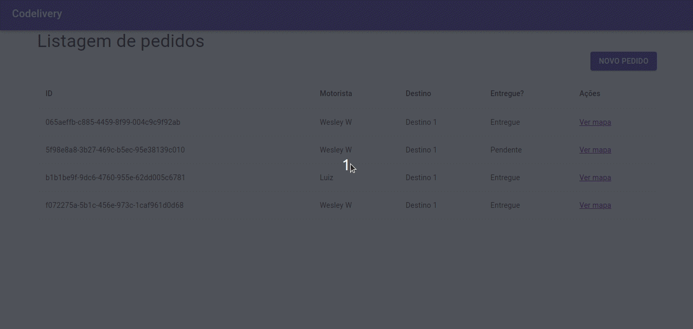
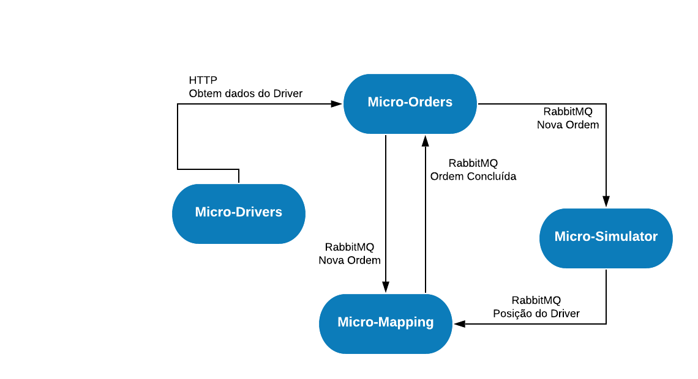

<p align="center">
    
</p>


<h6 align="center">Maratona Full Cycle Março/2020</h6>

<h4 align="center">
Projeto de um sistema de ordens de entregas (Delivery) com monitoramento realtime.
</h4>

</img>

<br>

### Detalhamento
A principio parece um simples CRUD mas por trás existem 5 Microsserviços trabalhando juntos, cada um se responsabiliza por um contexto diferente da aplicação e trabalhando em sintonia conseguem solucionar o problema. A Ideía principal é permitir a criação de ordens de entrega, selecionando o motorista e o destino. Um microsserviço escrito em Go Lang irá simular o deslocamento do motorista e esse deslocamento é monitorado em tempo real através de uma interface web desenvolvida com Reac JS.

E por fim, após o motorista chegar ao destino o micro serviço é notificado e então altera o status da entrega para "Entregue".

### Tecnologias utilizadas
- <b>RabbitMQ 3.8</b>: Faz a comunicação assincrona entre os microsserviços
- <b>Go Lang 1.14</b>
- <b>NodeJs 12.14</b>
- <b>Framework NestJS</b>
- <b>Framework RactJS</b>
- <b>Mysql 5.7</b>
- <b>Docker</b>

### Microsserviços
- <b>Micro-Drivers:</b> Mantem o cadastro de motoristas.

- <b>Micro-Orders:</b> Responsável pela criação de ordens de entregas, tudo o que se refere a Ordens de Entrega será responsabilidade deste microsserviço. Irá comunica-se com Micro-Drivers via http request para obter informações do driver. Notificara o Micro-Mapping e Micro-Simulator que uma nova orden foi criada.

- <b>Micro-Mapping:</b> Responspável por manter o RealTime do posicionamento do motorista e identifica se o mesmo chegou ao destino notificando o Micro-Order que o motorista finalizou a entrega.

- <b>Micro-Simulator:</b> Responsavel por simulator o deslocamento do motorista.

</img>

### Pré-requisitos
- Docker
- Docker Compose

### Instalação
``` bash
sudo docker-compose up -d
```

